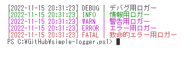
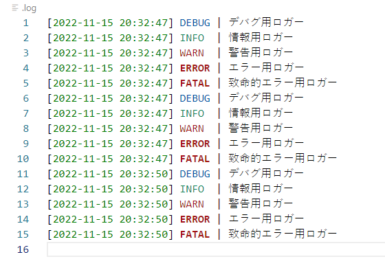

# simple-logger.ps1

PowerShellでのシンプルロギング関数群です。  

  
  

## 使い方

出力方法は以下の3つ。  
括弧内はデフォルトの設定値。  

- コンソール(ON)
- ファイル(ON)
- HTTPリクエスト(OFF)

---

最初に`Logger`クラスのインスタンスを生成。  

```ps1
$logger = [Logger]::new()
```

ログ出力には用意されているレベル用のメソッドを呼び出す。  

```ps1
$logger.Debug("デバグ用ロガー")
$logger.Info("情報用ロガー")
$logger.Warn("警告用ロガー")
$logger.Error("エラー用ロガー")
$logger.Fatal("致命的エラー用ロガー")
```

---

ロガーインスタンス生成時に`(ファイル, コンソール, HTTPリクエスト)`の出力のオンオフを切り替えることができる。  

```ps1
# 全てオン
$logger = [Logger]::new($true, $true, $true)

# HTTPリクエストだけ
$logger = [Logger]::new($false, $false, $true)

# デフォルト(ファイルとコンソール)
$logger = [Logger]::new()
```

ファイルだけ、ファイルとコンソールだけのオーバーロードも指定可能。  

```ps1
# コンソールだけ
$logger = [Logger]::new($false)
```

モード文字列指定も可能。  
3文字でファイル、コンソール、HTTPリクエストの順でオンにしたい部分を1にセット。  

```ps1
# 全てオン
$logger = [Logger]::new("111")

# HTTPリクエストだけ
$logger = [Logger]::new("001")
```

---

後から専用のメソッドを使用してオンオフを変更可能。  

- ChangeFileOutputMode
- ChangeConsoleOutputMode
- ChangeHttpOutputMode

---

ログファイル出力先とHTTPリクエスト送信先はそれぞれ以下のメソッドで指定可能。  

- SetLogFilePath
- SetHttpPostUri

---

ログ出力レベルは`SetEmittingLevel`メソッドで指定可能。  
デフォルトは`All`。  

出力レベルは以下の7つ。  

- All
- Debug
- Info
- Warn
- Error
- Fatal
- Off

---

HTTPリクエストはPOSTメソッドで以下のJSONを送信。  

```json
{
  "datetime": "日時時刻",
  "level": "出力レベル",
  "message": "メッセージ"
}
```

### 動作確認

`./app/main.ps1`を実行する。  
デフォルトでHTTPリクエストを送信するように設定しているため、これを受け取るために、簡易サーバである`./app/server.ps1`を実行する。  

管理者権限が必要なため、使用したくない場合には`$logger = [Logger]::new($true, $true, $true)`の部分を`$logger = [Logger]::new()`に変更してHTTPリクエストをオフにする。  
